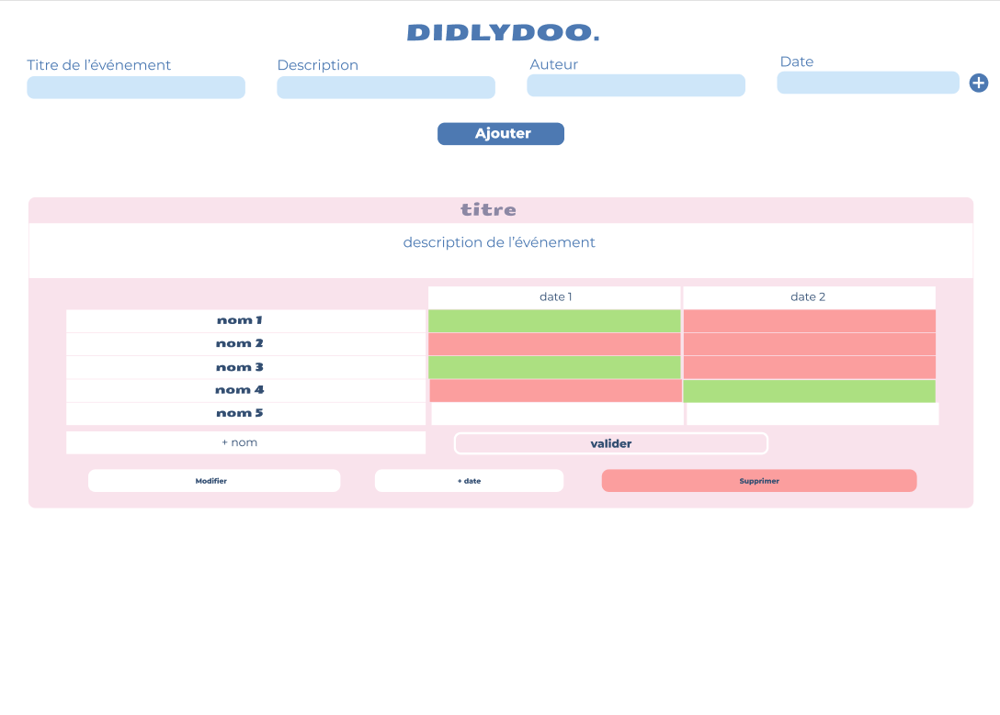
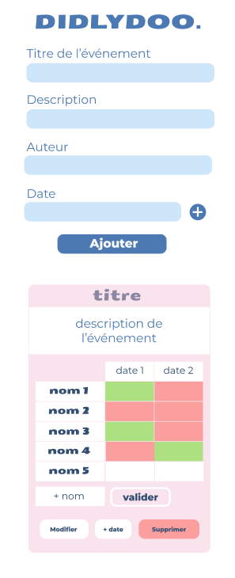

# Didlydoo

In this repository, you will find our project that finalizes our basic learning of DOM oriented Javascript, the use of APIs as well as the presence of dark mode.

This site is responsive and includes a mobile version and a desktop version. It uses an personnal API to work.

---

Project completed

This repository was created and edited on January 5, 2023. This project is an exercise realized during the training web developer junior given by Becode.org

---

## Language

- HTML
- SCSS
- JS

---

## How to install the repository locally

Explanations not complete
1. create a local working folder
2. open Git Bash
3. clone the repository
4. now you can work on the file
